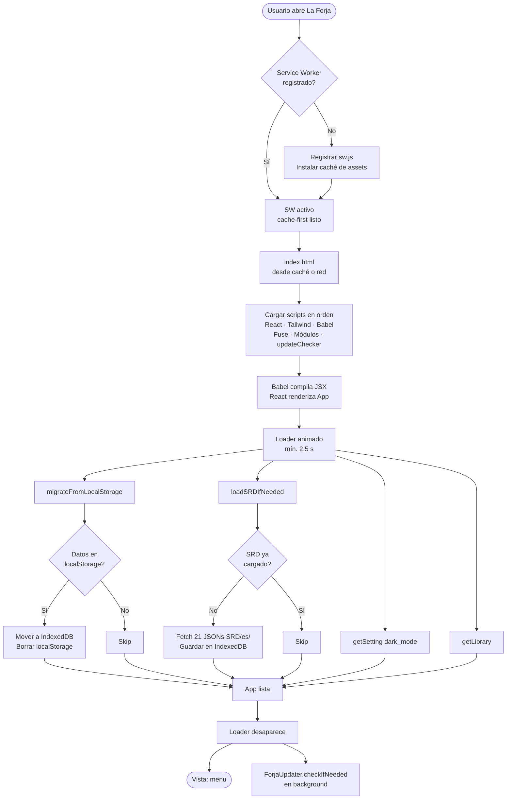
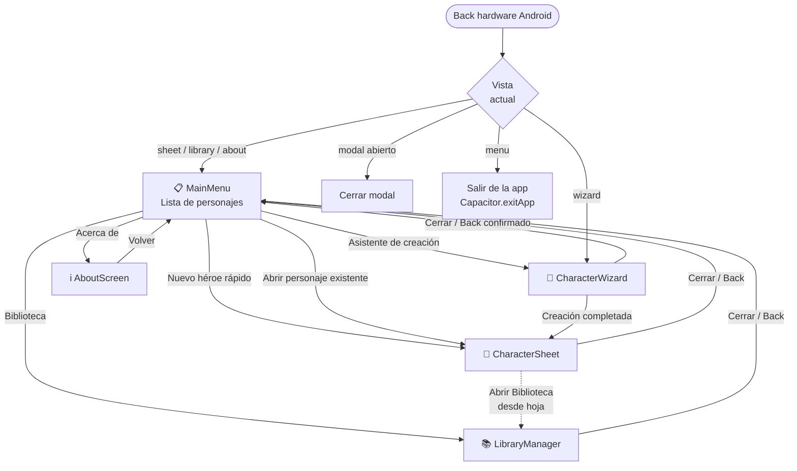
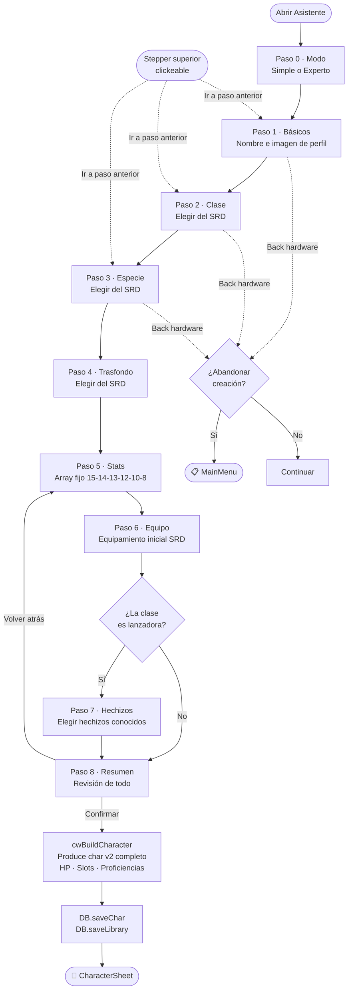
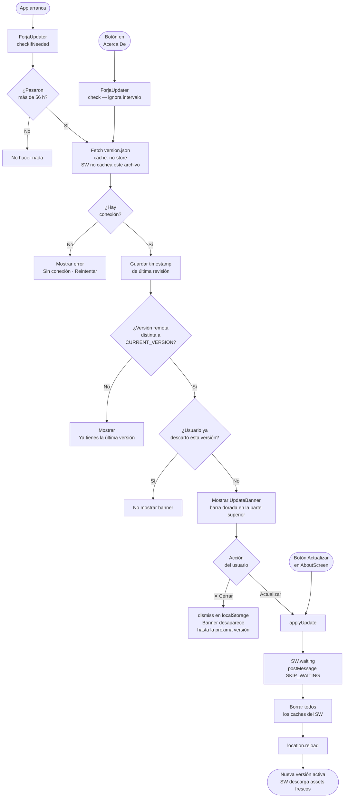

# La Forja — Diagramas de Flujo
_v15.0 · 2026-06-27_

> Renderizar con la extensión **Markdown Preview Mermaid Support** en VS Code,
> o pegar el bloque en [mermaid.live](https://mermaid.live)

---

## 1. Arranque de la App

---

## 2. Navegación entre Vistas

---

## 3. Character Wizard — 9 Pasos

---

## 4. Sistema de Actualizaciones OTA

